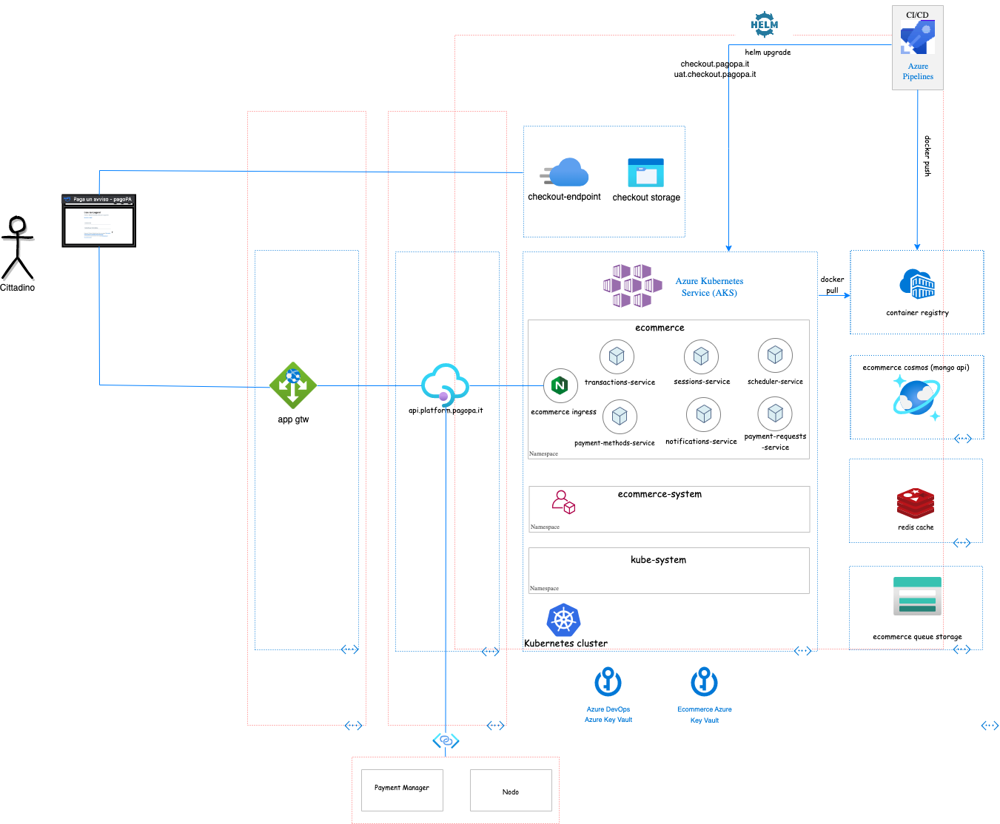

# pagopa-ecommerce-local

All you need to start the whole pagopa eCommerce platform locally for development purposes and integration tests:



for more details you can read [ecommerce details](https://pagopa.atlassian.net/wiki/spaces/I/pages/492339720/eCommerce+pagoPA+Design+Review+draft "eCommerce pagoPA Design Review") 

### Configure

Configuration is done by editing your local .env file

In the _.env_ file there are a configurations related to conainers that can be customized, in particular the container ports and the services git branch to run a given version of microservices.

| name                              | description                                                                                                                 |
| --------------------------------- | --------------------------------------------------------------------------------------------------------------------------- |
| MONGO_PORT                        | The port the mongodb listens to.                                                                                            |
| MONGO_EXPRESS_PORT                | The port the mongo-express listens to.                                                                                      |
| REDIS_PORT                        | The port the redis listens to.                                                                                              |
| REDIS_INSIGHT_PORT                | The port the redis-insight listens to.                                                                                      |
| REDIS_PORT                        | The port the redis listens to.                                                                                              |
| NODO_MOCK_PORT                    | The port the nodo-mock listens to.                                                                                          |
| NODO_MOCK_COMMIT_SHA              | The branch you want to build from. Used when the code is fetched from remote repo.                                          |
| ECOMMERCE_SESSIONS_PORT           | The port the pagopa-ecommerce-sessions-service listens to.                                                                  |
| ECOMMERCE_SESSIONS_COMMIT_SHA     | The branch of pagopa-ecommerce-sessions-service you want to build from. Used when the code is fetched from remote repo.     | 
| ECOMMERCE_TRANSACTIONS_PORT       | The port the pagopa-ecommerce-transactions-service listens to.                                                              |
| ECOMMERCE_TRANSACTIONS_COMMIT_SHA | The branch of pagopa-ecommerce-transactions-service you want to build from. Used when the code is fetched from remote repo. |

In addiction, the parameters of the individual microservices can also be customized by editing the env file contained in the folder of the specific service.

### Run eCommerce pagoPA

```sh
docker-compose up
```

If you use the default configurations, we will have the following services exposed:
* `nodo-mock`: http://localhost:3002/webservices/pof/PagamentiTelematiciPspNodoservice
* `pagopa-ecommerce-sessions-service`: http://localhost:8082/sessions
* `pagopa-ecommerce-transactions-service`: http://localhost:8080

When running with the Docker container you can check data persisted to either Mongo or Redis with their respective web interfaces (Mongo express/Redis Insight). To do so, go to:
 * http://localhost:8001 for Redis Insight
 * http://localhost:8081 for Mongo Express